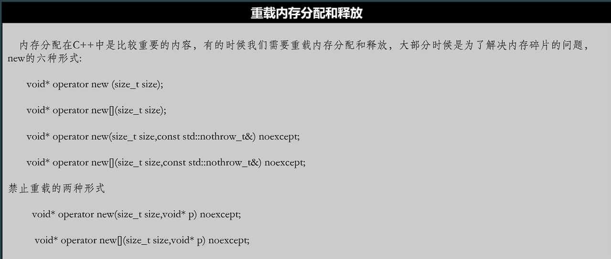

# c++ 基础笔记
## 基础数据类型即相关操作
1. typeid(variable).name()
3. 中文字符:字符串 0xghjk 中如果高位字节 0xgh >127(0x7f)则它一定是中文字符，0xghjk 作为整体代表一个汉字 
4. typedef oldtype newtype,简记:TNT( typedef name new type )
## 位运算
1. XOR 即为不进位加法
2. a XOR b = (a + b) -( (a &ｂ) ＜＜１ )，　其中　（a & b）为需要进位而没有进位的的位组成的值，对它进位（左移一位）再加上异或的值就是它们的和．由此可快速算异或的结果：　a + b －( (a&b) * 2 )
３．(a XOR b) + (a & b)=a | b　
4. a ^ 0 =a, a ^ (-1)= ~a
5. a ^ a =0
6. 补码的符号位扩展：在补码的左边补上原补码的符号位，不管补上几位，补码的值始终不变。
    a. 1010=11-1010=111111-1010(-只为了显示上区分原补码)
7. 补码的补码就是原码
## 运算符相关
2. 运算符优先级后缀++, -- 大于 (前缀++, --, +/-(正负)) 
    a. c= a+++b --> c =(a++) +b
    b. c = 2*-b---a; --> c = 2 * (-(b--) -a)
1. 一元运算符优先级大于二元运算符.
2. 位运算优先级大于逻辑运算
3. 优先级 ~! 大于 & 大于 |
## 内存对齐规则
1. 有效对齐值n
    a. 内置类型的对齐值即为自身大小.
    b. struct/class 的对齐值:成员中最大的对齐值，如有内嵌类型，不应以内嵌类型整体计算对齐值，而是计算其成员的最大对齐值 k.
    c. 可通过 #pragma pack(value) 指定对齐值.
    d. 如#pragma 指定的对齐值与 struct/class 自身对齐值不一致，以它们中较小的为有效对齐值(min(value, k)).
2. 对齐规则:
    a. 每个成员的起始地址应该是n的整数倍.
    b. struct/class 的整体大小应该是n的整数倍.
## auto 推断类型要点:
1. auto 不能保留const属性;
```
const int a=0;
auto c = a;
 ```
c是int 类型而非 const int 类型.
2. auto 会优先推断为值类型而非引用类型;
```
int a = 5;
int& la = a;
auto d = la;
```
d是int类型而不是int&

## decltype(expresion) 类型决断要点:
1. decltype内的表达式**没有经历任何运算**,那么推断出的类型即为表达式的类型，并且可以保留const 和引用属性.
2. decltype内的表达式**是运算后的结果**(*pa, pa[4],()括号 也是一种运算),那么推断出的类型即为表达式的类型，是否保留const和引用属性则要看结果是否左值来定，是左值的话才可以保留这两个属性.
3. decltype内的表达式是一个函数,推断的类型即为函数返回类型，但表达式里的函数不会真的执行,即使该函数的返回类型为auto.
当前进度:c/c++源文件混用的问题
## 声明与定义
1. 声明:指定一个类型的变量或函数，方便编译器的识别;不涉及内存的分配与初始化.
2. 定义:为变量或函数分配内存空间，如果是变量还可以做相应的初始化.
3. 函数默认只做声明，变量默认就是定义；要声明变量应使用`extern Type name;`这种格式, 变量仅作声明的话不能指定初始值，否则就是定义,因为初始化必然要分配内存.
4. 可以存在多个声明，但是只能存在一份定义.(否则编译器将报歧义错误，因其无法决定应使用哪份定义)
5. 只有全局变量可以声明，局部变量不行.因为局部变量不存在固定内存，外部无法稳定访问.
6. static 函数和inline 函数可以在头文件中声明，static 会使该函数**在且仅在当前文件有效**; inline函数则是直接替换，不存在内存分配，不会导致内存冲突问题.
## extern 关键字
1. c 语言和 c++函数名修饰风格不同（Windows 下 c 仅在 函数名前加上下划线, c++ 类似 func@@_argtype），因此混用c/c++源文件需要特殊处理.
2. `extern "C" {  int add(int, int); double mul(double, double)  }`可以把 {}内部的函数按 c风格来处理.
3. c 源文件和c++源文件不能同名，因为编译过后源文件将生成 name.obj 的目标文件，若同名将生成同名的obj文件，后续链接很可能报错.
4. `__cplusplus` 宏可用于区分当前文件是否c++文件. 配合 #ifdef 和 extern "C"可实现c/c++文件的混用
5. 由于c不支持函数重载， 一旦函数被 extern "C" 修饰，则它不能是重载的函数.
当前进度:23章已完成.
## 符号的链接属性:
### 链接属性有以下三种 
1. 内部链接属性:该符号仅在本[^TransferUnit]转换单元中有效. 通常符号只有在被 static 或者 unnamed namespace 修饰才会具有内部链接属性; 在符号前面加上 extern 可以使其转为外部链接属性.
2. 外部链接属性:该符号在其他转换单元中也有效.全局变量，一般函数都是外部链接属性; 使用static(不推荐) 或者 unnamed namespace 可以使其转为内部链接属性.
3. 无链接属性:该符号仅在其作用域内有效. 函数参数，局部变量均为无链接属性的.
## namespace
1. 同名namespace 的内容会被整合，共同作为其内容.( unnamed namespace 除外，它们是互相独立的 )
2. namespace tu=sea::fish;此语法可以定义 namespace 别名.
3. unnamed namespace 内部的所有符号都是内部链接属性，即使符号前面有 extern 修饰符.

---
[^TransferUnit]:每个源文件在include所需的头文件后，就是一个转换单元，每个转换单元编译后都会生成对应的 .obj 文件.

# 类
## 嵌套类
1. 嵌套类可以访问外层类的所有成员(嵌套类相当于外层类的友元)
2. 嵌套类不通过外部类的实例无法访问其非静态成员.
3. 外层类仅能访问嵌套类的公有成员；除了可以限制嵌套类的作用域之外没有别的特殊之处.
4. 嵌套类模块化时，嵌套类的头文件应包含外部类的头文件，外部类的头文件则不能包含嵌套类的头文件；否则会因声明顺序出现编译问题.
## 局部类[^2]
1. 局部类的定义必须写在类内.[^3]
2. 局部类在不能有静态成员变量.(静态成员函数在msvc 下可以支持).
3. 局部类可以访问全局变量.
## malloc 和new的本质区别:
1. 对于内置类型，它们没有区别．
2. 对于类,new除了分配内存，还会调用对应的构造函数,malloc 则只分配内存．
## free和delete的本质区别:
1. 对于内置类型，它们没有区别．
2. 对于类,delete除了释放内存，还会调用对应的析构函数,free 则只释放内存．
## delete和delete[]的区别：
1. 对于内置类型，它们没有区别．
2. 对于类，delete释放内存空间并调用第一个元素的析构函数, delete[]释放内存并调用每一个元素的析构函数.
## 类成员函数调用约定(X86, _thiscall):
1. 寄存器ecx用来存放类的实例地址,用做this指针.
2. 函数参数从右到左入栈.
3. 堆栈由被调用者负责恢复.
4. 成员函数访问非静态成员变量是都是使用指针加上偏移(this+offset)的方式访问的，不管是否显示的使用了this指针.
5. returntype _cdecl func(Arg1...),通关这种方式可以指定函数的调用约定.
## 类静态成员函数调用约定:(X86, _cdecl)
1. 函数参数从右到左入栈.
3. 堆栈由调用者负责恢复.
---
[^2]:定义在函数内部的类.
[^3]:局部类作用域仅在声明的函数内部;函数内部不能再声明函数;即函数不能嵌套.
## 运算符重载的原则和时机.
### 重载运算符的意义
1. 让类也支持原生的运算,+/-/* .etc.
2. 提升对程序的控制权，比如重载new/new[], delete/delete[].
3. 使代码更方便使用和维护，重载运算符未必能提升开发效率.
### 运算符重载的限制
1. 只能重载现有的运算符,不能自创运算符.
2. 以下运算符不能重载:
    a. 对象访问运算符.,例如:user.hp
    b. 作用域解析运算符::,如std::cout
    c. 求类型大小的运算符,如sizeof运算符
    d. 三元运算符 ?:
3. 不能修改运算符优先级，相关性(从左到右计算或从右到左计算)[^4]
4. c++17之后不能修改运算符操作数的计算顺序(例: a && b ,先算 a 还是先算b ),c++17之前可以修改，但这是未定义行为.
5. 除了new/new[],delete/delete[],不能内置类型的其他运算符进行修改.(例:将char类型的运算符＋重载为－的功能)．
6. 除了new/delete 之外，其他运算符关联的操作数的个数或者关联的参数一律不能修改.
###　运算符重载的原则
1. 不要改变运算符的意义.
2. 不建议重载逻辑运算符[^5](&&/||)取地址运算符＆和逗号运算符
3. 尽管运算符的返回类型可以是任何类型，但还是要尽量贴合原意.
### 只能重载为成员函数的操作符:
1. 赋值运算符=
2. 下标运算符[]
3. ()运算符
4. 类型转换运算符.((int)dVal.etc)
### 隐式类型转换带来的歧义问题
1. 构造函数和类型转换函数的歧义.
2. 可在类型转换运算符前面加上explicit来禁用隐式类型转换. explicit operator int();
### 类型转换运算符
1. 如要检查某个类里的指针是否为空，推荐重载该类的 operator void*()来实现这个功能，不推荐重载 bool转换运算符.

---
[^4]:所以赋值运算符(包括复合赋值运算符),单目运算符，三元运算符都是从右到左计算，剩下的都是从左到右计算.
[^5]:重载后的逻辑运算符将不会进行短路测试，才c++17标准前，编译器可以自由决定先计算左操作数还是右操作数，c++17之后规定为从左到右计算.

#运算符重载
## 如何防止程序内存数据被搜索
1. 取消内存对齐.
2. 加密数据:使显示的值和存储的真实值不一样.
    a. 异或
    b. 打乱字节存储顺序.
    c. 字节分散存储
## 后缀++/--运算符重载
1. syntax: const type operator++/--(int),这里函数参数仅为了满足函数重载，以达到区分前缀++/--和后缀++/--的目的.
2. 主要指针相关浅拷贝的问题.(copy constructor 否则场景易崩溃).
3. b++++++, 禁止后缀++/--连续调用,可通过返回const type 来实现.
## 重载内存分配和释放相关运算符:

1. new 的实现步骤:
    a. 分配内存空间.
    b. 调用对应构造函数.
    c. 返回指针.
2. delete 的实现步骤:
    a. 调用对应析构函数.
    b. 释放内存.
3. 我们自定义new/delete这两个运算符时，能接管的只有分配和释放内存两个步骤，其他的都是编译器完成的.
4. 内存管理运算符都是 static 成员函数:
    a. 分配内存时，还不存在类的实例，也就没有this指针.
    b. 释放内存时，析构函数已经调用完成，此时也没有this指针.
5. new 和delete 都是成对出现的，需要重载其中任一个就意味着两个都需要重载.
6. 重载时，应该实现所有版本的new和delete(见上图).
7. `void operator delete(void*)` 和 `void operator delete(void*, size_t size)`同时存在时，后者无效(它永远不会被调用).
8. 为了方便和灵活性,可以重载带有额外参数的new/delete运算符`void* operator new(size_t size, const char* pInfo)`和`void operator delete(void* adress, const char* Info)`,但这带有额外参数的delete版本无法手动调用，只有构造函数抛出异常时，编译器会自动调用.
## 委托构造函数只能委托给另一个构造函数吗?
    答:yes,受委托的函数在构造函数之前执行,在类的实例在构建之前没有分配内存，也就没有this指针,无法调用普通函数,而static member func 虽然可以正常调用但也没有意义,所以就禁用了这个.
## c++11之后 delete 可以用来删除函数:
    1. `function prototype =delete`; 例:`int func(args...)=delete;`
## 多继承带来的重复继承问题:
```
class A
{
    int x, y;
};
class B:public A{};
class C:public A{};
class D:public B, public C
{};
```
    此处D将有A的两份存储，它们内存互相独立，要解决这个问题，可通过关键字virtual 来解决.
```
class B:public vitual A{};
class C:public vitual A{};
```
此处virtual 将使多继承中，相同类只引入一次，从而避免上述同名变量不同地址的问题.
## virtual func 默认参数只会使用静态绑定版本所对应的值[^6],因为默认值是在编译器就决定的.
---
[^6]:override virtual func 在msvc 下必须每次都写上参数默认值，但没办法保证默认值一致,须小心一些保证默认值一致.

## 指针相关
### 复杂指针的读法:右左法则
    右左法则:首先从最靠近要解析符号的圆括号看起，然后往右看，再往左看。每当遇到圆括号时，就应该掉转阅读方向。一旦解东西，就跳出圆括号。重复这个过程直到整个声明解析完毕。
### 指针类型转换
1. 指针类型隐式向上转换开启条件:继承方式必须是 publc,`class B:publc A{}`, 如需要转换可以通关强制转换完成.
2. `class B:publc virtual A{}`虚基类的情况下向下转换是不允许的, 强制转换也不行.
3. 多继承情况下指针转换:
```
class Base{};
class Wolf: publc Base{};
class Man{}:publc Base{};
class WolfMan:publc Wolf, publc Man{};
```
```
WolfMan obj;
void* p0=&obj; 
Wolf* p1=&obj;
Man* p2=&obj;
```
    a. 此处p0==p1 !=p2, 因为内存布局顺序是跟继承顺序一致的,p1, p2 分别拿到的是自身对应内存的首地址,p1 & p2 直接相差的是Wolf 的大小.
    b. `Wolf* p3=(Wolf*)p0; Man* p4=(Man*)p0;`, 此处 p0==p3==p4,因为p0是一个无类型的指针.
    c. `Base* p5=&obj;`此处向上转换为基类是不允许的(即使是强制转换),编译器无法确定p5要指向同时存在的多个Base 内存区域中的哪一个.
    d. 假如`class Try:publc Wolf, publc Base{}; Try obj2;`, 则隐式转换`Base* p6=&obj2;`可行且p6指向Base所在内存区域，而不是Wolf内部的Base 所在的内存区域.
4. dynamic_cast只能用于支持方法多态类型的指针(存在虚函数的类的指针),另外dynamic_cast不推荐用于引用的转换，因为不存在null引用所以转换失败的话它会直接抛出异常.另外, dynamic_cast<Dst*>(Src*)能否成功只看Src*所指内存区域是否包含Dst的类型的内存区域,包含的话就可以成功转换，不需要 Src 和 Dst存在继承关系.
    a. 跨类转换:`class Boss{}; class crossSam:publc Wolf, publc Boss{}; crossSam obj; Wolf* p6=&obj; auto p7=dynamic_cast<Boss*>(p6);` p7会成功得到相应Boss内存区域的指针.
### 虚函数表的性质
1. 一个类至多只有一个虚函数表.虚函数表位于内存中的常量区
2. 通过修改虚函数表可以实现劫持.
3. 只有通过指针访问函数才会调用虚函数表.